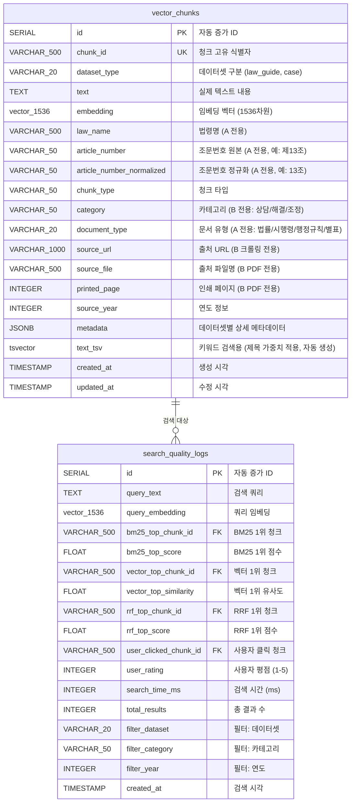

# ERD (Entity-Relationship Diagram)

**작성일**: 2026-01-28
**데이터베이스**: PostgreSQL 17.2 + pgvector 0.8.1
**버전**: 3.1.0 (제목 가중치 시스템 적용)
**목적**: A_law_ED_guide + B_case 통합 벡터 검색 시스템

---

## 📊 ERD 다이어그램



---

## 🗂️ 테이블 상세 설명

### 1. **vector_chunks** (메인 테이블)

**용도**: 모든 청크 데이터 통합 저장 (A_law_ED_guide + B_case)

#### 주요 컬럼

| 컬럼명 | 데이터 타입 | 제약조건 | 설명 | 인덱스 |
|--------|-------------|----------|------|--------|
| **id** | SERIAL | PRIMARY KEY | 자동 증가 ID | PK |
| **chunk_id** | VARCHAR(500) | UNIQUE NOT NULL | 청크 고유 식별자 | UNIQUE |
| **dataset_type** | VARCHAR(20) | NOT NULL, CHECK | 'law_guide' 또는 'case' | B-tree |
| **text** | TEXT | NOT NULL | 실제 텍스트 내용 (원본) | - |
| **embedding** | vector(1536) | NOT NULL | 임베딩 벡터 | HNSW |
| **text_tsv** | tsvector | - | 키워드 검색용 (제목 가중치 적용, 자동 생성) | GIN |
| **law_name** | VARCHAR(500) | - | 법령명 (A 전용) | B-tree |
| **article_number** | VARCHAR(50) | - | 조문번호 원본 (A 전용, 예: 제13조) | B-tree |
| **article_number_normalized** | VARCHAR(50) | - | 조문번호 정규화 (A 전용, 예: 13조, 자동 생성) | B-tree |
| **chunk_type** | VARCHAR(50) | - | 청크 타입 | B-tree |
| **category** | VARCHAR(50) | - | 카테고리 (B 전용) | B-tree |
| **document_type** | VARCHAR(20) | - | 문서 유형 (A 전용: 법률/시행령/행정규칙/별표) | B-tree |
| **source_url** | VARCHAR(1000) | - | 출처 URL (B 크롤링) | B-tree |
| **source_file** | VARCHAR(500) | - | PDF 파일명 (B PDF) | B-tree |
| **printed_page** | INTEGER | - | 인쇄 페이지 (B PDF) | - |
| **source_year** | INTEGER | - | 연도 정보 | B-tree |
| **metadata** | JSONB | - | 상세 메타데이터 | GIN |
| **created_at** | TIMESTAMP | DEFAULT NOW() | 생성 시각 | B-tree |
| **updated_at** | TIMESTAMP | DEFAULT NOW() | 수정 시각 | - |

#### 제약조건

```sql
CHECK (dataset_type IN ('law_guide', 'case'))
UNIQUE (chunk_id)
NOT NULL (chunk_id, dataset_type, text, embedding)
```

#### 인덱스 (총 21개)

**기본 인덱스**:
- `idx_chunk_id` (UNIQUE): chunk_id
- `idx_dataset_type` (B-tree): dataset_type
- `idx_law_name` (B-tree, WHERE law_name IS NOT NULL): law_name
- `idx_article_number` (B-tree, WHERE article_number IS NOT NULL): article_number
- `idx_article_number_normalized` (B-tree, WHERE article_number_normalized IS NOT NULL): article_number_normalized
- `idx_chunk_type` (B-tree): chunk_type
- `idx_category` (B-tree, WHERE category IS NOT NULL): category
- `idx_document_type` (B-tree, WHERE document_type IS NOT NULL): document_type
- `idx_created_at` (B-tree): created_at

**출처 정보 인덱스**:
- `idx_source_url` (B-tree, WHERE source_url IS NOT NULL): source_url
- `idx_source_file` (B-tree, WHERE source_file IS NOT NULL): source_file
- `idx_source_year` (B-tree, WHERE source_year IS NOT NULL): source_year
- `idx_source_file_page` (복합, WHERE source_file IS NOT NULL): (source_file, printed_page)

**복합 인덱스**:
- `idx_dataset_category` (WHERE category IS NOT NULL): (dataset_type, category)
- `idx_law_chunk_type` (WHERE law_name IS NOT NULL): (law_name, chunk_type)
- `idx_law_article` (WHERE law_name IS NOT NULL): (law_name, article_number)
- `idx_law_article_normalized` (WHERE law_name IS NOT NULL): (law_name, article_number_normalized)

**전문 검색 인덱스 (제목 가중치 적용)**:
- `idx_text_tsv` (GIN): text_tsv (하이브리드 검색 BM25용, 제목 A=0.6, 본문 B=0.4)
- `idx_metadata_gin` (GIN): metadata
- `idx_metadata_keywords` (GIN, WHERE dataset_type = 'law_guide'): (metadata->'keywords')

**벡터 인덱스**:
- `idx_embedding_hnsw` (HNSW): embedding (vector_cosine_ops, m=16, ef_construction=64)

#### 트리거

**1. updated_at 자동 갱신**:
```sql
CREATE TRIGGER trigger_update_updated_at
BEFORE UPDATE ON vector_chunks
FOR EACH ROW
EXECUTE FUNCTION update_updated_at_column();
```

**2. article_number 자동 정규화** (NEW):
```sql
CREATE TRIGGER trigger_auto_normalize_article
BEFORE INSERT OR UPDATE OF article_number
ON vector_chunks
FOR EACH ROW
EXECUTE FUNCTION auto_normalize_article_trigger();
-- 기능: article_number에서 "제"를 제거하여 article_number_normalized 자동 생성
-- 예시: "제13조" → "13조", "제16조제2항" → "16조2항"
```

**3. tsvector 자동 생성 (제목 가중치 적용)** (UPDATED):
```sql
CREATE TRIGGER tsvector_update
BEFORE INSERT OR UPDATE ON vector_chunks
FOR EACH ROW EXECUTE FUNCTION
update_text_tsv_with_weights();
-- 기능:
-- - law_guide: text의 첫 줄을 제목(A=0.6)으로, 나머지를 본문(B=0.4)으로 가중치 적용
-- - case: metadata->>'title'을 제목(A=0.6)으로, text를 본문(B=0.4)으로 가중치 적용
-- - 검색 시 ts_rank_cd('{0.1, 0.2, 0.4, 0.6}', ...) 사용하여 제목 매칭 1.5배 높은 점수
```

#### 유틸리티 함수

**1. normalize_article_number(article TEXT)** (NEW):
- 조문번호 정규화 함수
- 기능: "제" 문자열 제거
- 예시: normalize_article_number('제13조') → '13조'

**2. update_text_tsv_with_weights()** (NEW):
- 제목 가중치 적용 tsvector 생성
- 제목(A=0.6), 본문(B=0.4) 가중치 자동 적용
- dataset_type에 따라 제목 추출 방식 상이

**3. search_hybrid_rrf()** (UPDATED):
- BM25 + 벡터 + RRF 통합 검색
- filter_document_type 파라미터 추가
- 가중치 배열 {0.1, 0.2, 0.4, 0.6} 적용

**4. search_bm25()** (UPDATED):
- BM25 키워드 검색
- filter_document_type 파라미터 추가
- ts_rank_cd()에 가중치 배열 적용

---

### 2. **search_quality_logs** (검색 품질 모니터링)

**용도**: 하이브리드 검색 품질 및 사용자 피드백 추적

#### 주요 컬럼

| 컬럼명 | 데이터 타입 | 제약조건 | 설명 |
|--------|-------------|----------|------|
| **id** | SERIAL | PRIMARY KEY | 자동 증가 ID |
| **query_text** | TEXT | NOT NULL | 검색 쿼리 |
| **query_embedding** | vector(1536) | - | 쿼리 임베딩 |
| **bm25_top_chunk_id** | VARCHAR(500) | - | BM25 1위 청크 ID |
| **bm25_top_score** | FLOAT | - | BM25 1위 점수 |
| **vector_top_chunk_id** | VARCHAR(500) | - | 벡터 검색 1위 청크 ID |
| **vector_top_similarity** | FLOAT | - | 벡터 1위 유사도 |
| **rrf_top_chunk_id** | VARCHAR(500) | - | RRF 통합 1위 청크 ID |
| **rrf_top_score** | FLOAT | - | RRF 1위 점수 |
| **user_clicked_chunk_id** | VARCHAR(500) | - | 사용자가 클릭한 청크 ID |
| **user_rating** | INTEGER | CHECK (1-5) | 사용자 평점 (1-5점) |
| **search_time_ms** | INTEGER | - | 검색 소요 시간 (밀리초) |
| **total_results** | INTEGER | - | 총 결과 수 |
| **filter_dataset** | VARCHAR(20) | - | 사용된 필터: 데이터셋 |
| **filter_category** | VARCHAR(50) | - | 사용된 필터: 카테고리 |
| **filter_year** | INTEGER | - | 사용된 필터: 연도 |
| **created_at** | TIMESTAMP | DEFAULT NOW() | 검색 시각 |

#### 제약조건

```sql
CHECK (user_rating BETWEEN 1 AND 5)
```

#### 인덱스

- `idx_search_logs_created_at` (B-tree): created_at
- `idx_search_logs_query_text` (GIN): to_tsvector('simple', query_text)

#### 관계

**논리적 외래키 (Foreign Key 미설정)**:
- `bm25_top_chunk_id` → `vector_chunks.chunk_id`
- `vector_top_chunk_id` → `vector_chunks.chunk_id`
- `rrf_top_chunk_id` → `vector_chunks.chunk_id`
- `user_clicked_chunk_id` → `vector_chunks.chunk_id`

**참고**: 성능상의 이유로 FK 제약조건은 설정하지 않음 (로그 테이블)

---

## 🔗 테이블 관계

### 관계 유형

```
vector_chunks (1) ────── (0..*) search_quality_logs
                    검색 대상

- vector_chunks: 청크 데이터 (검색 대상)
- search_quality_logs: 검색 로그 (어떤 청크가 검색되었는지 기록)
```

### 관계 설명

**1:N 관계**:
- 하나의 청크(`vector_chunks`)는 여러 번 검색될 수 있음
- 각 검색마다 로그(`search_quality_logs`)가 생성됨

**참조 무결성**:
- FK 제약조건은 설정하지 않음 (로그 테이블 특성상)
- 애플리케이션 레벨에서 참조 무결성 관리
- 청크 삭제 시 로그는 유지 (히스토리 보존)

---

## 📐 데이터셋별 컬럼 사용 패턴

### A_law_ED_guide (법령 데이터)

| 컬럼 | 사용 | 예시 값 |
|------|------|---------|
| dataset_type | ✅ 고정 | `'law_guide'` |
| text | ✅ | "제16조(청약철회) 소비자는..." |
| embedding | ✅ | [0.123, -0.456, ...] |
| law_name | ✅ | "소비자기본법" |
| article_number | ✅ | "제13조", "제16조제2항" |
| article_number_normalized | ✅ 자동 생성 | "13조", "16조2항" |
| chunk_type | ✅ | "조_전체", "항_조항" 등 |
| category | ❌ NULL | - |
| document_type | ✅ | "법률", "시행령", "행정규칙", "별표" |
| source_url | ❌ NULL | - |
| source_file | ❌ NULL | - |
| printed_page | ❌ NULL | - |
| source_year | ✅ | 2023 (시행일 연도) |
| metadata | ✅ | {"법령번호": "법률 제20432호", ...} |

### B_case - 크롤링 데이터

| 컬럼 | 사용 | 예시 값 |
|------|------|---------|
| dataset_type | ✅ 고정 | `'case'` |
| text | ✅ | "질문: 환불 거부... 답변: ..." |
| embedding | ✅ | [0.234, -0.567, ...] |
| law_name | ❌ NULL | - |
| article_number | ❌ NULL | - |
| article_number_normalized | ❌ NULL | - |
| chunk_type | ✅ 고정 | `'case'` |
| category | ✅ | "상담", "해결", "조정" |
| document_type | ❌ NULL | - |
| source_url | ✅ | "https://www.consumer.go.kr/..." |
| source_file | ❌ NULL | - |
| printed_page | ❌ NULL | - |
| source_year | ❌ NULL | (선택적) |
| metadata | ✅ | {"number": "11342", "title": "..."} |

### B_case - PDF 데이터

| 컬럼 | 사용 | 예시 값 |
|------|------|---------|
| dataset_type | ✅ 고정 | `'case'` |
| text | ✅ | "신청인은 2010.1.16. ..." |
| embedding | ✅ | [0.345, -0.678, ...] |
| law_name | ❌ NULL | - |
| article_number | ❌ NULL | - |
| article_number_normalized | ❌ NULL | - |
| chunk_type | ✅ 고정 | `'case'` |
| category | ✅ | "해결", "조정" |
| document_type | ❌ NULL | - |
| source_url | ❌ NULL | - |
| source_file | ✅ | "2020년 소비자분쟁 해결사례집.pdf" |
| printed_page | ✅ | 48 |
| source_year | ✅ | 2020 |
| metadata | ✅ | {"item_name": "가구", ...} |

---

## 🔍 주요 검색 쿼리 패턴

### 1. 하이브리드 검색 (BM25 + 벡터 + RRF) - 제목 가중치 적용

```sql
SELECT * FROM search_hybrid_rrf(
    '소비자기본법 제16조 환불',        -- query_text
    '[0.1, 0.2, ...]'::vector(1536),  -- query_embedding
    'case',                            -- filter_dataset
    '조정',                            -- filter_category
    '별표',                            -- filter_document_type (NEW)
    2020,                              -- filter_year
    10,                                -- result_limit
    60                                 -- rrf_k
);
```

**내부 조인**:
```sql
-- BM25 결과와 벡터 결과를 FULL OUTER JOIN
-- RRF 통합 후 vector_chunks와 JOIN하여 원본 데이터 가져오기
-- ts_rank_cd('{0.1, 0.2, 0.4, 0.6}', ...) 사용하여 제목 가중치 적용
-- 제목 매칭: 0.6 가중치, 본문 매칭: 0.4 가중치 (1.5배 차이)
```

### 2. 카테고리별 검색

```sql
SELECT chunk_id, text, category, source_file
FROM vector_chunks
WHERE dataset_type = 'case'
  AND category = '조정'
  AND source_year = 2020;
```

### 3. 법령 검색 (조문번호 정규화 활용)

```sql
-- 방법 1: 정규화된 조문번호로 검색 (사용자가 "13조" 또는 "제13조" 입력 가능)
SELECT chunk_id, text, law_name, article_number, chunk_type
FROM vector_chunks
WHERE dataset_type = 'law_guide'
  AND law_name = '소비자기본법'
  AND article_number_normalized = '13조';  -- "제13조"로 입력해도 자동 정규화

-- 방법 2: 문서 유형으로 필터링 (NEW)
SELECT chunk_id, text, law_name, document_type, chunk_type
FROM vector_chunks
WHERE dataset_type = 'law_guide'
  AND document_type = '별표'  -- 법률, 시행령, 행정규칙, 별표
  AND law_name LIKE '%소비자%';

-- 방법 3: 법령 + 조문 복합 검색 (idx_law_article_normalized 인덱스 활용)
SELECT chunk_id, text, article_number, chunk_type
FROM vector_chunks
WHERE dataset_type = 'law_guide'
  AND law_name = '소비자기본법'
  AND article_number_normalized LIKE '16조%';  -- 16조, 16조2항 등 검색
```

### 4. 검색 품질 분석

```sql
SELECT * FROM search_quality_analysis
WHERE search_date >= CURRENT_DATE - INTERVAL '30 days'
ORDER BY search_date DESC;
```

**내부 조인**:
```sql
-- search_quality_logs를 DATE로 그룹핑
-- 평균 CTR, 검색 시간, 정확도 계산
```

---

## 📊 데이터 통계 (2026-01-28 기준)

| 항목 | A_law_ED_guide | B_case (Semantic Chunking) | 합계 |
|------|----------------|----------------------------|------|
| **총 레코드 수** | 6,077 | 32,603 | **38,680** |
| **평균 text 길이** | ~500자 | ~800자 | ~700자 |
| **평균 레코드 크기** | ~12KB | ~15KB | ~14KB |
| **총 테이블 크기** | ~73 MB | ~490 MB | **~563 MB** |
| **인덱스 크기** | ~180 MB | ~700 MB | **~880 MB** |
| **총 디스크 사용량** | - | - | **~1.5 GB** |

**참고**:
- 제목 가중치 시스템 적용 (2026-01-28)
- 조문번호 정규화 시스템 적용
- 문서 유형 분류 완료 (법률/시행령/행정규칙/별표)

---

## 🎯 설계 특징

### 1. **단일 테이블 통합** (Single Table Design)

**장점**:
- ✅ 통합 벡터 검색 (HNSW 인덱스 1개)
- ✅ 하이브리드 검색 간소화 (UNION 불필요)
- ✅ 관리 복잡도 감소

**단점**:
- ⚠️ NULL 컬럼 존재 (dataset_type별 사용 컬럼 상이)
- ⚠️ 스키마 변경 시 영향 범위 큼

### 2. **컬럼 설계 전략**

**별도 컬럼 추출**:
- 자주 필터링되는 필드: law_name, category, source_year, document_type
- 조문 검색: article_number, article_number_normalized
- 출처 정보: source_url, source_file, printed_page
- **이유**: B-tree 인덱스 사용 가능, 검색 성능 향상

**JSONB 메타데이터**:
- 데이터셋별 고유 필드
- 자주 변경되는 필드
- **이유**: 스키마 유연성, GIN 인덱스로 검색 가능

### 3. **인덱스 전략**

**3가지 인덱스 타입 병행**:
1. **B-tree**: 정확한 일치, 범위 검색 (category, source_year, article_number_normalized)
2. **GIN**: 전문 검색, JSONB 검색 (text_tsv, metadata)
3. **HNSW**: 벡터 유사도 검색 (embedding)

### 4. **조문번호 정규화 시스템** (NEW)

**자동 정규화**:
- 트리거를 통한 자동 변환: "제13조" → "13조"
- 검색 유연성: 사용자가 "13조" 또는 "제13조" 입력 가능
- 복합 인덱스 활용: (law_name, article_number_normalized)로 빠른 검색

### 5. **제목 가중치 시스템** (NEW)

**가중치 적용**:
- text_tsv에 제목(A=0.6)과 본문(B=0.4) 가중치 차별화
- 검색 시 ts_rank_cd('{0.1, 0.2, 0.4, 0.6}', ...) 사용
- 효과: 제목 매칭 시 본문 매칭 대비 1.5배 높은 점수

**제목 추출**:
- law_guide: text의 첫 줄 (예: "제1조(목적)")
- case: metadata->>'title' (예: "노트북 환불 문의")

### 6. **문서 유형 분류** (NEW)

**분류 체계**:
- law_guide 데이터: 법률, 시행령, 행정규칙, 별표
- 활용: 사용자가 "해결기준"과 "해결사례"를 구분하여 검색 가능
- 인덱스: idx_document_type, idx_dataset_document_type

### 7. **검색 품질 모니터링**

**별도 로그 테이블**:
- 메인 테이블과 분리 (성능 영향 최소화)
- FK 미설정 (로그 특성상 참조 무결성 불필요)
- 검색 알고리즘 비교 가능 (BM25 vs 벡터 vs RRF)

---

## 🔄 데이터 흐름

### 삽입 시

```
원본 JSONL 파일
    ↓
Python 스크립트 (02_01_insert_*.py)
    ↓
데이터 변환 (청크 → 테이블 레코드)
    ↓
PostgreSQL INSERT
    ↓
트리거 자동 실행:
  - text_tsv 생성 (to_tsvector)
  - updated_at 갱신
    ↓
인덱스 자동 업데이트:
  - B-tree, GIN, HNSW
```

### 검색 시

```
사용자 쿼리
    ↓
FastAPI 엔드포인트
    ↓
쿼리 임베딩 생성 (OpenAI API)
    ↓
PostgreSQL 하이브리드 검색:
  - BM25 검색 (GIN 인덱스)
  - 벡터 검색 (HNSW 인덱스)
  - RRF 통합
    ↓
결과 반환 (chunk_id, text, 출처 정보)
    ↓
검색 로그 기록 (search_quality_logs)
```

---

## 📝 참고사항

### 외래키 미사용 이유

**설계 결정**: search_quality_logs ↔ vector_chunks 간 FK 미설정

**이유**:
1. **성능**: 로그 테이블에 대량 INSERT 시 FK 검사 오버헤드
2. **유연성**: 청크 삭제 후에도 히스토리 보존
3. **독립성**: 로그 테이블 독립적 운영 가능

### tsvector 자동 생성 (제목 가중치 적용)

**트리거 사용**:
- 매 INSERT/UPDATE 시 text_tsv 자동 생성
- 제목과 본문에 다른 가중치 적용 (A=0.6, B=0.4)
- 수동 관리 불필요
- 항상 text와 동기화 보장

**제목 추출 로직**:
- law_guide: text 첫 줄 (예: "제1조(목적)")
- case: metadata->>'title' 활용
- 기타: 빈 제목으로 처리

### 조문번호 자동 정규화

**트리거 사용**:
- INSERT/UPDATE 시 article_number → article_number_normalized 자동 변환
- normalize_article_number() 함수로 "제" 제거
- 검색 유연성 확보: "13조" 또는 "제13조" 모두 매칭

**예시**:
- "제13조" → "13조"
- "제16조제2항" → "16조2항"
- "제5조의2" → "5조의2"

### JSONB vs 별도 컬럼

**별도 컬럼**:
- 자주 필터링: category, law_name, source_year, document_type, article_number_normalized
- B-tree 인덱스 활용
- 정규화 및 자동 변환 적용 가능

**JSONB**:
- 데이터셋별 고유 필드
- 스키마 유연성
- GIN 인덱스로 검색 가능

### 검색 성능 최적화 전략

**1. 메타데이터 필터링 우선**:
- 벡터 검색 전에 document_type, category 등으로 범위 축소
- 검색 속도 향상 + 정확도 향상

**2. 복합 인덱스 활용**:
- (law_name, article_number_normalized): 법령 조문 검색
- (dataset_type, category): 사례 카테고리 검색
- (source_file, printed_page): PDF 출처 추적

**3. 제목 가중치로 재순위화**:
- BM25 검색 시 제목 매칭이 본문 매칭보다 1.5배 높은 점수
- 사용자가 원하는 정보의 정확한 위치 파악

---

## 📋 변경 이력

### 버전 3.1.0 (2026-01-28)
- ✅ 제목 가중치 시스템 추가 (text_tsv: 제목 A=0.6, 본문 B=0.4)
- ✅ 조문번호 정규화 시스템 추가 (article_number, article_number_normalized)
- ✅ 문서 유형 분류 추가 (document_type: 법률/시행령/행정규칙/별표)
- ✅ 관련 인덱스 5개 추가 (총 21개)
- ✅ 트리거 2개 업데이트 (정규화, 제목 가중치)
- ✅ 검색 함수 업데이트 (가중치 배열 적용)

### 버전 1.0 (2026-01-23)
- 초기 스키마 설계
- 기본 벡터 검색 및 하이브리드 검색 구현
- 16개 인덱스 구성

---

**문서 버전**: 3.1.0
**최종 수정**: 2026-01-28
